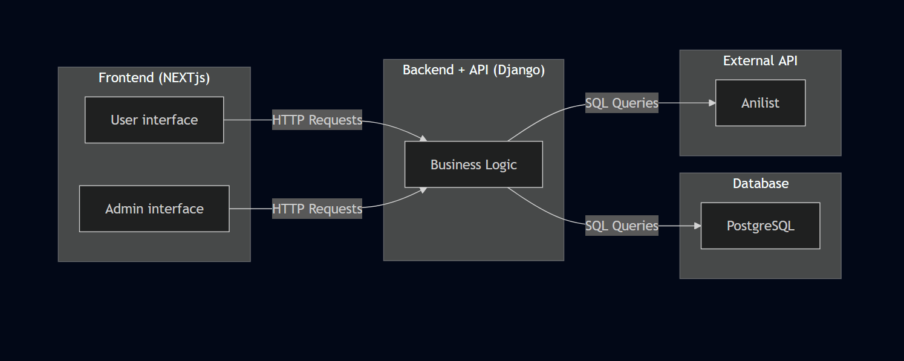
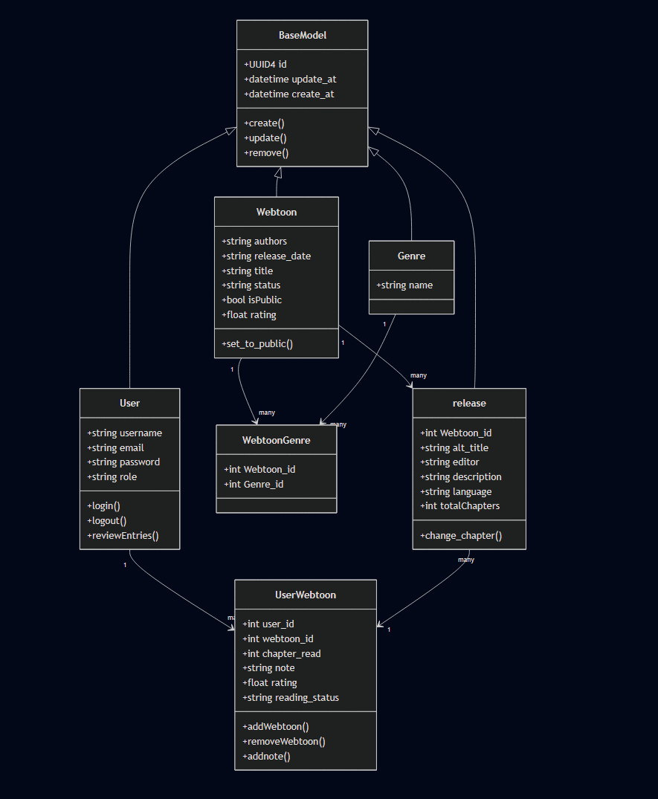
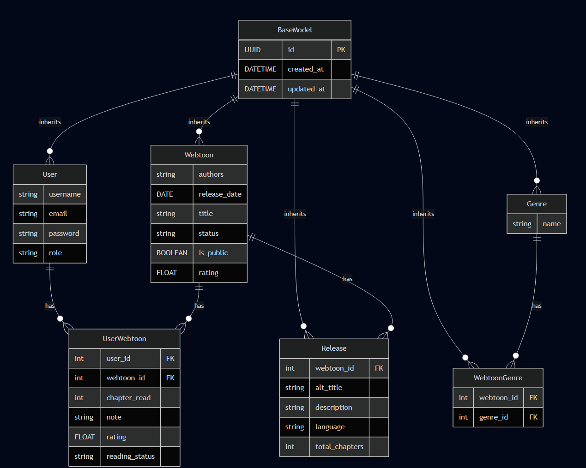
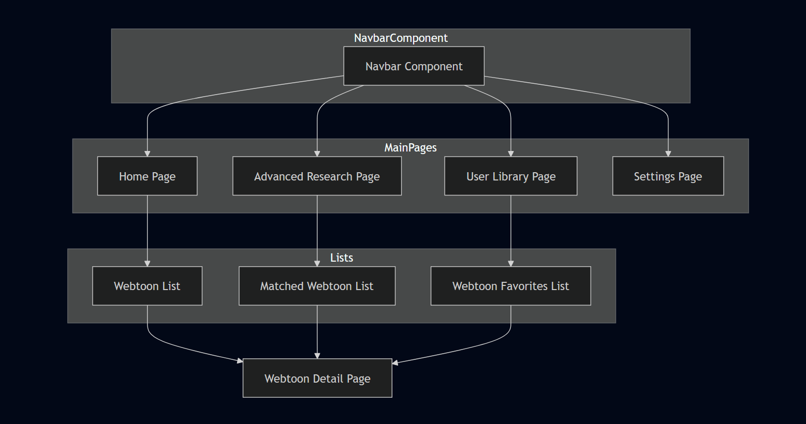
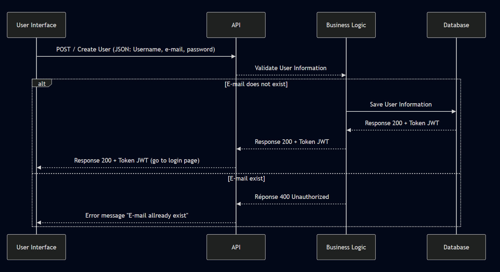
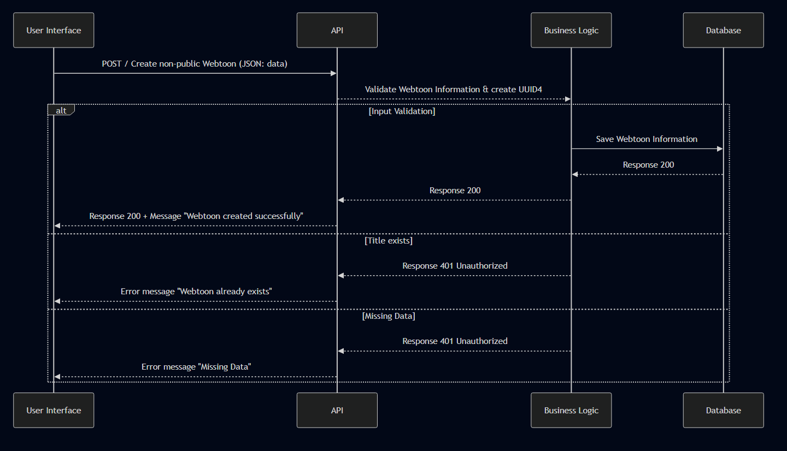
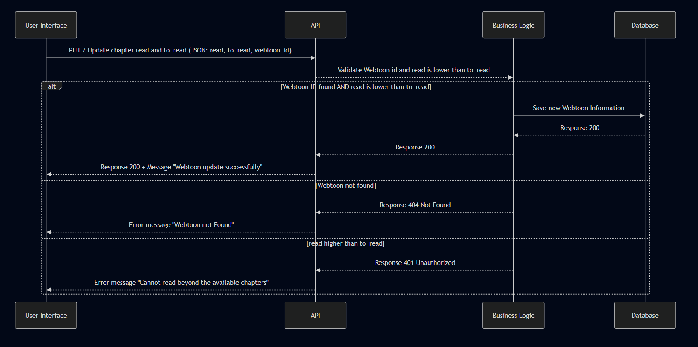

# The Boken project

## 1. User Stories and Mockups

### User Stories

1. Home Page
   *As a user, I want to view the home page so that I can see all recently modified or new webtoons and search for webtoons by name.*

2. Advanced Search Page
   *As a user, I want to use the advanced search page so that I can find webtoons by genre, name, number of chapters, or status.*

3. Settings Page
   *As a user, I want to access the settings page so that I can configure my experience on the site according to my preferences.*

4. Webtoon Details Page
   *As a user, I want to view the details page of a webtoon so that I can see all the relevant information about it, including title, authors, description, and release data.*

5. Library Page
   *As a user, I want to access my library page so that I can see the webtoons I want to read or have already read.*

6. Create Webtoon Page
   *As a user, I want to access the page to create a new webtoon so that I can add all the important information about it for other users to see.*

### Mockups

## 2. System Architecture

This System Architecture Diagram represents a high-level view of the site architecture. There are three main elements:
* Frontend : (with Next.js) represents the user and admin interface.
* Backend + API : (with Django) represents the backend that receives HTTP requests and handles them by performing SQL queries to the Database.
* Database : (with PostgreSQL) represents the database that will stores all the user and webtoon data.  

 

## 3. System structure and data model

### class diagram

The class diagram that represents the structure of our database. 
Here is a short description of each table :
* BaseModel : the parent class of all classes, implementing key methods and variables like ID.
* Webtoon : represents data of Webtoon (title, release date, authors...).
* Genre : represents the different Genre that exist.
* User : a registered user with personal information.
* WebtoonGenre : junction table linking Webtoons and Genres
* Release: represents all translations of a Webtoon and data linked to (alt title, description, total chapter out... ).
* UserWebtoon: junction table linking Users and Webtoons.  

 

### ER diagram

The ER diagram represents the relation between elements in the database. 
Here is a short description of each element :
* BaseModel : the parent class of all classes, implementing key methods and variables like ID.
* Webtoon : represents data of Webtoon (title, release date, authors...).
* Genre : represents the different Genre that exist.
* User : a registered user with personal information.
* WebtoonGenre : junction table linking Webtoons and Genres.
* Release: represents all translations of a Webtoon and data linked to (alt title, description, total chapter out... ).
* UserWebtoon : junction table linking Users and Webtoons.  

 

### front-end component diagram

the front-end component diagram represent how the different parts of a user interface (UI) are organized and how they interact with each other. 
here is a short description of each element :
* Navbar Component : A navigation bar that allow the user move between pages.
* Home Page : The first page where the user arrives.
* Webtoon List : A list of webtoons ordered by last modification.
* Webtoon Detail Page : A page where all the details of a webtoon are displayed.
* Advanced Search Page : A page that allow the user search for a particular webtoon with adjustable parameters.
* Matched Webtoon List : The list of all webtoons that match the user’s search parameters.
* User Library Page : The user’s library containing all the webtoons they are currently reading.
* Webtoon Favorites List : The list of all the user’s favorite webtoons.
* Settings Page : The page where the user can configure the site’s settings.
* Validation Page : The page where the admin can approve or reject a user’s request to publish webtoon data.  

 

## 4. Sequence Diagrams

These 3 Sequence Diagrams each represent a key interaction between : 
* The Frontend (User Interface) : where the user will interact and send http request.
* The API : receives the HTTP request and forwards it to the business logic.
* The business logic : validates the data sent, and if correct, saves it in the database.
* The database : database where all data is saved.
 
the key interaction is :

### User creation
Represents a visitor creating an account.  

1. The frontend sends the user creation request.
2. The API receives it and validates the data.
3. The data is saved in the database.
4. A response is sent back to the business logic.
5. The response is returned to the API.
6. The response is displayed on the frontend.
7. If the email already exists, an error is generated.
8. The error message is displayed on the frontend. 

 

### Webtoon creation
Represents a user creating a webtoon.  

1. The frontend sends the Webtoon creation request.
2. The API receives it and validates the data.
3. The data is saved in the database.
4. A response is sent back to the business logic.
5. The response is returned to the API.
6. The response is displayed on the frontend.
7. If the title already exists, an error is generated.
8. The error message is displayed on the frontend.
9. If some data is missing, an error is generated.
10. The error message is displayed on the frontend. 

 

### Chatper update
Represents a user updating their reading progress and/or the number of chapters released.  

1. The frontend sends the chapter modification request.
2. The API receives it and validates the data.
3. The data is saved in the database.
4. A response is sent back to the business logic.
5. The response is returned to the API.
6. The response is displayed on the frontend.
7. If the Webtoon alris not found, an error is generated.
8. The error message is displayed on the frontend.
9. If the data is invalid (chapter read higher than chapter out), an error is generated.
10. The error message is displayed on the frontend. 

 

## 5. API Specifications

This table summarizes all available API endpoints, including their URL paths, HTTP methods, required input formats, and expected output formats. 

| **API Endpoint** | **URL Path** | **HTTP Method** | **Input Format** | **Output Format** |
| ---------------- | ------------ | --------------- | ---------------- | ----------------- |
| **User Authentication** | `/api/auth/login` | `POST` | JSON (email, password) | JSON (token) |
| **User Creation** | `/api/user/` | `POST` | JSON (email, password, username) | JSON (success, msg) |
| **User Retrieval All** | `/api/user/` | `GET` | Nothing | JSON ({{id, email, username, created_at, updated_at}, ...}) |
| **User Retrieval** | `/api/user/{user_id}` | `GET` | Path parameter: user_id | JSON (id, email, username, created_at, updated_at) |
| **User Update** | `/api/user/{user_id}` | `PUT` | JSON (email?, password?, username?) | JSON (success, msg) |
| **User Deletion** | `/api/user/{user_id}` | `DELETE` | Path parameter: user_id | JSON (success, msg) |
| **Genre Creation** | `/api/genre/` | `POST` | JSON (name) | JSON (success, msg) |
| **Genre Retrieval All** | `/api/genre/` | `GET` | Nothing | JSON ({{id, name}, ...}) |
| **Genre Retrieval** | `/api/genre/{genre_id}` | `GET` | Path parameter: genre_id | JSON (id, name) |
| **Genre Update** | `/api/genre/{genre_id}` | `PUT` | JSON (name) | JSON (success, msg) |
| **Genre Deletion** | `/api/genre/{genre_id}` | `DELETE` | Path parameter: genre_id | JSON (success, msg) |
| **Webtoon Creation** | `/api/webtoon/` | `POST` | JSON (authors, release_date, title, status, rating, alt_title, description, language, total_chapters) | JSON (success, msg) |
| **Webtoon Retrieval All** | `/api/webtoon/` | `GET` | Nothing | JSON {{id, title, description, status, rating, updated_at, memo}, ...} |
| **Webtoon Retrieval** | `/api/webtoon/{webtoon_id}` | `GET` | Path parameter: webtoon_id | JSON (id, authors, release_date, title, status, rating, alt_title, description, language, total_chapters, memo) |
| **Webtoon Update** | `/api/webtoon/{webtoon_id}` | `PUT` | JSON (authors?, release_date?, title?, status?, rating?, alt_title?, description?, language?, total_chapters?) | JSON (success, msg) |
| **Webtoon Deletion** | `/api/webtoon/{webtoon_id}` | `DELETE` | Path parameter: webtoon_id | JSON (success, msg) |
| **Release Creation** | `/api/release/` | `POST` | JSON (webtoon_id, alt_title, description, language, total_chapters) | JSON (success, msg) |
| **Release Retrieval All** | `/api/release/` | `GET` | Nothing | JSON ({{id, webtoon_id, alt_title, description, language, total_chapters}, ...}) |
| **Release Retrieval** | `/api/release/{release_id}` | `GET` | Path parameter: release_id | JSON (id, webtoon_id, alt_title, description, language, total_chapters) |
| **Release Update** | `/api/release/{release_id}` | `PUT` | JSON (alt_title?, description?, language?, total_chapters?) | JSON (success, msg) |
| **Release Deletion** | `/api/release/{release_id}` | `DELETE` | Path parameter: release_id | JSON (success, msg) |
| **Admin Review** | `/api/admin_review` | `POST` | JSON(approval, msg_review) | JSON (success, msg) |
| **Change Chapter** | `/api/webtoon/{webtoon_id}/chapter` | `PUT` | JSON(chapter, total_chapters) | JSON (success, msg) |
| **Add Webtoon Library** | `/api/library/` | `POST` | JSON(webtoon_id, user_id) | JSON (success, msg) |
| **Webtoon Library Retrieval** | `/api/library/` | `GET` | Nothing | JSON({{id, title, description, status, rating, memo, updated_at}, ...}) |
| **Webtoon Library Retrieval by User** | `/api/library/{user_id}` | `GET` | Path param (user_id in path) | JSON (id, authors, release_date, title, status, rating, alt_title, description, language, total_chapters, memo, updated_at) |
| **Webtoon Library Removal** | `/api/library/{webtoon_id}` | `DELETE` | Path parameter: webtoon_id | JSON (success, msg) |

## 6. SCM and QA Plans

### SCM plan

* Version control : In this project, we will use Git and GitHub .
* branches organization : The branches will be  as main → dev → feature, where
    * main : contains the final working product.
    * dev : integrates all features.
    * feature : contains individual features, such as the user page (frontend) or the webtoon endpoint (backend).
* Control plan: For each push to the dev branch, a code review meeting will be conducted to decide where it should be merged.

### QA plan

* Define a testing strategy : Implement unit tests for backend logic, API endpoints, and frontend components; include integration tests for full user flows (e.g., user registration, webtoon creation, library updates).
* Specify testing tools : Use Django’s built-in testing framework for backend, Jest/React Testing Library for frontend, and Postman for API endpoint verification.
* Deployment pipeline : Set up a CI/CD pipeline with automated tests, staging environment for pre-production verification, and production deployment with rollback options.

## 7. Technical Justifications

**Next.js (Front-end):**

* React-based framework, fast and modern.

* Allows us to improve SEO thanks to server-side rendering.

* Simplifies the creation of interfaces and navigation between pages.

**Django (Back-end):**

* Robust and secure Python framework.

* Includes a powerful ORM to interact easily with the database.

* The Django REST Framework module makes it easy to create APIs.

**PostgreSQL (Database):**

* Reliable, high-performance relational database.

* Manages relationships between users, projects and tasks.

* Also supports more complex data (JSON if required).

**GitHub/Git (Control version):**

* Standard tool for managing and sharing code.

* Allows several people to work together without overwriting each other's work.

* Pull requests and branches help keep code clean.

**VSCode (IDE):**

* Simple and popular editor.

* Compatible with Python (Django) and JavaScript (Next.js).

* Useful extensions for Git, PostgreSQL and debugging.
