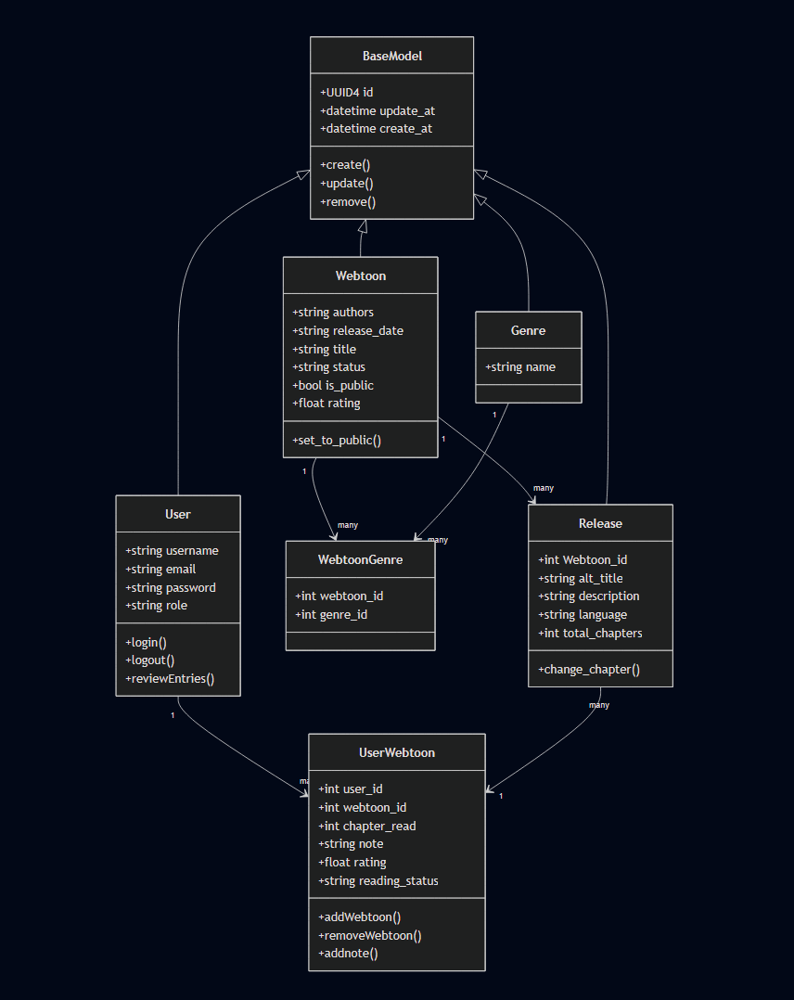
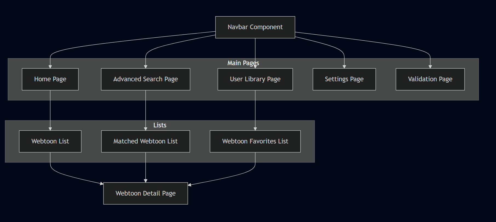

# The Boken project

## 1. User Stories and Mockups

## 2. System Architecture

This System Architecture Diagram represent an higher view of the architecture of the site there are 3 element :
* Frontend : (with NEXTjs) is representing the user and admin interface
* Backend + API : (with Django) is representing the back that will receive that http request and handle them to do SQL Queris to the Database
* Database : (with PostgreSQL) is representing the database that will stock all the user and webtoon data  

 

## 3. System structure and data model

### class diagram

the class diagram that represente the structure of our database 
here is a short description of each table :
* BaseModel : the mother class of all class to implement important methode and variable like ID 
* Webtoon : class that represent data of Webtoon (title, release date, authors...)
* Genre : class represent the different Genre that exist
* User : user that is register with their personal information
* WebtoonGenre : table that link genre between Webtoon
* release : represent all traduction of a Webtoon and data that is link to (alt title, description, total chapter out... )
* UserWebtoon : table that link User between Webtoon  

 

### ERdiagram

the ERdiagram represente the relation between element 
here is a short description of each element :
* BaseModel : the mother class of all class to implement important methode and variable like ID 
* Webtoon : class that represent data of Webtoon (title, release date, authors...)
* Genre : class represent the different Genre that exist
* User : user that is register with their personal information
* WebtoonGenre : table that link genre between Webtoon
* release : represent all traduction of a Webtoon and data that is link to (alt title, description, total chapter out... )
* UserWebtoon : table that link User between Webtoon  

 

### front-end_component_diagram

the front-end component diagram represent how the different parts of a user interface (UI) are organized and how they interact with each other. 
here is a short description of each element :
* Navbar Component : A navigation bar that lets the user move between pages.
* Home Page : The first page where the user arrives.
* Webtoon List : A list of webtoons ordered by last modification.
* Webtoon Detail Page : A page where all the details of a webtoon are displayed.
* Advanced Research Page : A page that lets the user search for a particular webtoon with adjustable parameters.
* Matched Webtoon List : The list of all webtoons that match the user’s search parameters.
* User Library Page : The user’s library containing all the webtoons they are currently reading.
* Webtoon Favorites List : The list of all the user’s favorite webtoons.
* Settings Page : The page where the user can configure the site’s settings.  

 

## 4. Sequence Diagrams

this 3 Sequence Diagram represent each a key interaction between : 
* the front : where the user will interact and send http request
* the API : get the http request and send to the business logic
* the business logic : test the data send and if it s all right save in database
* the database : database where all data is save
 
the key interaction is :

### User creation
represent the visitor that create a account to become a user of the site  

 

### Webtoon creation
represent the user that create a webtoon for himself with all mandatory data and Optional data  

 

### Chatper update
represent the user that want to update his reading progress or/and the number of chapter that is out  

 

## 5. API Specifications

| **API Endpoint** | **URL Path** | **HTTP Method** | **Input Format** | **Output Format** |
| ---------------- | ------------ | --------------- | ---------------- | ----------------- |
| **User Authentication** | `/api/auth/login` | `POST` | JSON (email, password) | JSON (token) |
| **User Creation** | `/api/user/` | `POST` | JSON (email, password, username) | JSON (success, msg) |
| **User Retrieval All** | `/api/user/` | `GET` | Nothing | JSON ({{id, email, username, created_at, updated_at}, ...}) |
| **User Retrieval** | `/api/user/{user_id}` | `GET` | Path param (id in path) | JSON (id, email, username, created_at, updated_at) |
| **User Update** | `/api/user/{user_id}` | `PUT` | JSON (email?, password?, username?) | JSON (success, msg) |
| **User Deletion** | `/api/user/{user_id}` | `DELETE` | Path param (id in path) | JSON (success, msg) |
| **Genre Creation** | `/api/genre/` | `POST` | JSON (name) | JSON (success, msg) |
| **Genre Retrieval All** | `/api/genre/` | `GET` | Nothing | JSON ({{id, name}, ...}) |
| **Genre Retrieval** | `/api/genre/{genre_id}` | `GET` | Path param (id in path) | JSON (id, name) |
| **Genre Update** | `/api/genre/{genre_id}` | `PUT` | JSON (name) | JSON (success, msg) |
| **Genre Deletion** | `/api/genre/{genre_id}` | `DELETE` | Path param (id in path) | JSON (success, msg) |
| **Webtoon Creation** | `/api/webtoon/` | `POST` | JSON (authors, release_date, title, status, rating, alt_title, description, language, total_chapters) | JSON (success, msg) |
| **Webtoon Retrieval All** | `/api/webtoon/` | `GET` | Nothing | JSON {{id, title, description, status, rating, updated_at, memo}, ...} |
| **Webtoon Retrieval** | `/api/webtoon/{webtoon_id}` | `GET` | Path param (id in path) | JSON (id, authors, release_date, title, status, rating, alt_title, description, language, total_chapters, memo) |
| **Webtoon Update** | `/api/webtoon/{webtoon_id}` | `PUT` | JSON (authors?, release_date?, title?, status?, rating?, alt_title?, description?, language?, total_chapters?) | JSON (success, msg) |
| **Webtoon Deletion** | `/api/webtoon/{webtoon_id}` | `DELETE` | Path param (id in path) | JSON (success, msg) |
| **Release Creation** | `/api/release/` | `POST` | JSON (webtoon_id, alt_title, description, language, total_chapters) | JSON (success, msg) |
| **Release Retrieval All** | `/api/release/` | `GET` | Nothing | JSON ({{id, webtoon_id, alt_title, description, language, total_chapters}, ...}) |
| **Release Retrieval** | `/api/release/{release_id}` | `GET` | Path param (id in path) | JSON (id, webtoon_id, alt_title, description, language, total_chapters) |
| **Release Update** | `/api/release/{release_id}` | `PUT` | JSON (alt_title?, description?, language?, total_chapters?) | JSON (success, msg) |
| **Release Deletion** | `/api/release/{release_id}` | `DELETE` | Path param (id in path) | JSON (success, msg) |
| **Admin Review** | `/api/admin_review` | `POST` | JSON(approval, msg_review) | JSON (success, msg) |
| **Change Chapter** | `/api/webtoon/{webtoon_id}/chapter` | `PUT` | JSON(chapter, total_chapter) | JSON (success, msg) |
| **Add Webtoon Library** | `/api/library/` | `POST` | JSON(webtoon_id, user_id) | JSON (success, msg) |
| **Webtoon Library Retrieval** | `/api/library/` | `GET` | Nothing | JSON({{id, title, description, status, rating, memo, updated_at}, ...}) |
| **Webtoon Library Retrieval by User** | `/api/library/{user_id}` | `GET` | Path param (user_id in path) | JSON (id, authors, release_date, title, status, rating, alt_title, description, language, total_chapters, memo, updated_at) |
| **Webtoon Library Removal** | `/api/library/{webtoon_id}` | `DELETE` | Path param (id in path) | JSON (success, msg) |

## 6. SCM and QA Plans

## 7. Technical Justifications

